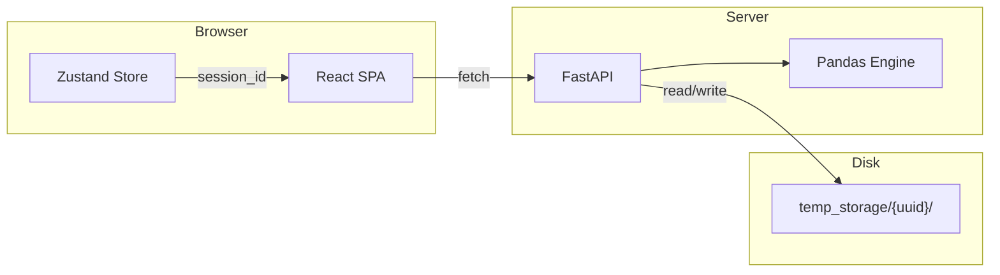
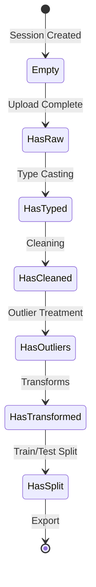
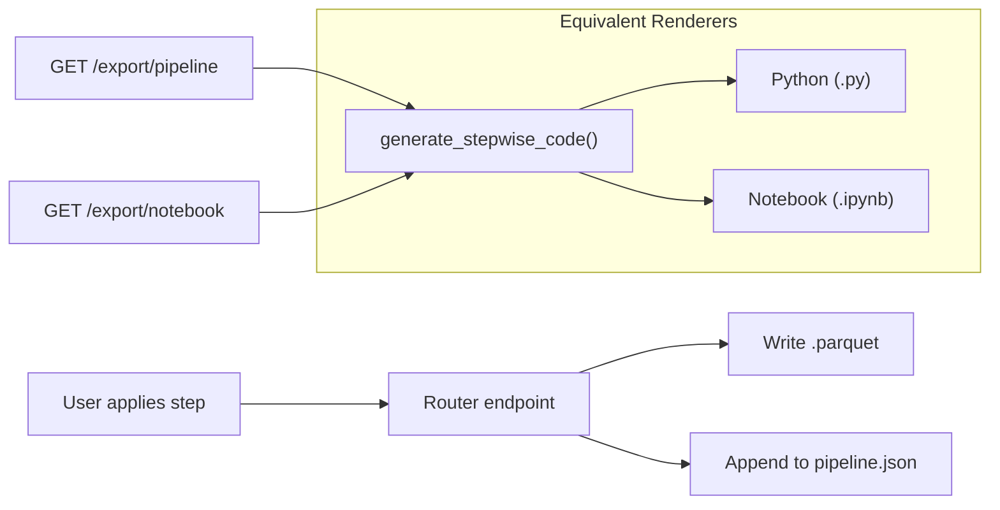

# ML Preprocessing Tool — System Document

> **Classification:** Internal Engineering Documentation  
> **Audience:** Staff+ engineers extending or productionizing this system  
> **Last Updated:** 2025-12-24

---

## 1. Executive Summary

### Problem Statement

Data scientists spend 60-80% of ML project time on data preprocessing. This work is repetitive, error-prone, and poorly documented. Most preprocessing happens in Jupyter notebooks that don't survive to production.

### Solution

A web-based wizard that guides users through an 8-step preprocessing pipeline, persisting state at each step and producing export-ready train/test splits. The system prioritizes:

1. **Discoverability** — Surface data quality issues proactively
2. **Reversibility** — Never destroy original data; checkpoint each step
3. **Portability** — Export to multiple formats (CSV, Parquet, JSON)

### Target Audience

- Data scientists preparing datasets for model training
- ML engineers building reproducible data pipelines
- Analysts exploring data quality before analysis

### Value Proposition

- Zero-code preprocessing with visual feedback
- Session isolation for concurrent users
- Parquet-based columnar storage for performance
- Wizard UX prevents skipping critical steps

---

## 2. System Goals and Explicit Non-Goals

### Goals

| Goal | Implementation |
|------|----------------|
| **Guided workflow** | 8-step wizard with linear progression |
| **Data quality visibility** | Diagnostics page with warnings, correlations |
| **Non-destructive editing** | Each step writes new `.parquet`, preserving history |
| **Session isolation** | UUID-based folders, no shared state |
| **Format flexibility** | Export as CSV, Parquet, or JSON |

### Explicit Non-Goals

| Non-Goal | Rationale |
|----------|-----------|
| **Multi-user collaboration** | Complexity; single-user sessions are sufficient for MVP |
| **Real-time streaming data** | Batch processing only; streaming requires different architecture |
| **Model training** | Out of scope; this is preprocessing only |
| **Data versioning** | No Git-like history; only latest checkpoint matters |
| **Cloud storage integration** | Local filesystem only; S3/GCS is a deployment concern |
| **Authentication** | Assumed trusted environment (local or VPN) |

---

## 3. Architecture Overview



### Key Architectural Decisions

#### Why a Monolithic Backend?

The backend is a single FastAPI process with 8 routers. This is intentional:

- **Simplicity** — No service mesh, no RPC, no distributed state
- **Atomic operations** — Each API call reads, transforms, and writes in one process
- **Development velocity** — One `uvicorn` command runs everything

The tradeoff is horizontal scaling requires sticky sessions or shared storage.

#### Why Frontend State is Minimal?

The Zustand store holds only:
- `sessionId` — UUID for API calls
- `currentStep` — Wizard position (0-7)
- `metaStats` — Cached upload response

Each step component fetches its own data on mount. This prevents:
- Stale data after backend mutations
- Complex cache invalidation logic
- Memory bloat from storing entire DataFrames

The tradeoff is more API calls, but they're fast (Parquet reads are sub-50ms for typical datasets).

---

## 4. Core Components and Responsibilities

### Backend Routers

| Router | Primary Responsibility | Critical Invariant |
|--------|------------------------|-------------------|
| `upload.py` | Session creation, file parsing | Must create session folder atomically |
| `diagnostics.py` | Read-only analysis | Never mutates data |
| `types.py` | Column type casting | Writes `data_typed.parquet` |
| `cleaning.py` | Missing value handling | Writes `data_cleaned.parquet` |
| `outliers.py` | IQR/Z-score treatment | Writes `data_outliers.parquet` |
| `transforms.py` | Scaling, encoding | Writes `data_transformed.parquet` |
| `split.py` | Train/test partitioning | Writes `train.parquet`, `test.parquet` |
| `export.py` | Format conversion, download | Read-only, streams response |

### Frontend Components

| Component | Role | State Management |
|-----------|------|------------------|
| `App.tsx` | Shell, step router | Reads `currentStep` from Zustand |
| `FileUploadZone` | Drag-drop ingestion | Writes `sessionId` to Zustand |
| `HealthDashboard` | Quality metrics | Local state, fetches on mount |
| `TypeCasting` | Type conversion UI | Local state |
| `CleaningStudio` | Imputation controls | Local state |
| `OutlierDetector` | Outlier treatment | Local state |
| `FeatureEngineering` | Scaling/encoding | Local state |
| `DataSplitter` | Split ratio slider | Local state |
| `ExportPanel` | Download buttons | Read-only |

---

## 5. Data Flow and State Transitions

### Session State Machine



### File Progression

Each mutation creates a new checkpoint:

```
temp_storage/{uuid}/
├── data_raw.parquet         # Immutable after upload
├── data_typed.parquet       # Created by /update-types
├── data_cleaned.parquet     # Created by /apply-cleaning
├── data_outliers.parquet    # Created by /treat-outliers
├── data_transformed.parquet # Created by /apply-transforms
├── train.parquet            # Created by /split
└── test.parquet             # Created by /split
```

### Resolution Logic

Every router uses `get_latest_parquet()` to find the most recent checkpoint:

```python
PRIORITY = ["data_transformed", "data_outliers", "data_cleaned", "data_typed", "data_raw"]
for name in PRIORITY:
    if (session_path / f"{name}.parquet").exists():
        return path
```

This allows skipping steps (e.g., go from upload directly to split) while still reading the best available data.

---

## 6. Design Decisions & Tradeoffs

### Why Parquet?

| Consideration | Parquet | CSV | SQLite |
|---------------|---------|-----|--------|
| Columnar reads | ✅ Fast | ❌ Full scan | ❌ Row-oriented |
| Type preservation | ✅ Native | ❌ String-based | ✅ Schema |
| Compression | ✅ Snappy default | ❌ None | ⚠️ Manual |
| Pandas integration | ✅ `read_parquet()` | ✅ `read_csv()` | ⚠️ `read_sql()` |
| Human readability | ❌ Binary | ✅ Text | ❌ Binary |

**Decision:** Parquet wins for ML workloads where columnar access patterns dominate (e.g., scaling one column, encoding another).

### Why Filesystem Sessions?

Alternatives considered:

| Option | Pros | Cons |
|--------|------|------|
| **Filesystem** | Simple, no dependencies | Doesn't scale horizontally |
| **Redis** | Fast, TTL built-in | Memory-bound, serialization overhead |
| **PostgreSQL** | ACID, queryable | Schema per session? Complex |
| **S3** | Scales infinitely | Latency, eventual consistency |

**Decision:** Filesystem is the right choice for a local-first tool. Production deployment can swap to S3 via environment config.

### Why Stepwise Persistence?

Alternative: Keep DataFrame in memory, persist only at the end.

| Approach | Pros | Cons |
|----------|------|------|
| **Stepwise persistence** | Fault tolerance, browser refresh safe | More I/O, disk usage |
| **In-memory** | Fast, simple | Lost on crash, memory pressure |

**Decision:** Stepwise persistence ensures no work is lost. Users can close browser and resume.

### Why This Frontend State Model?

Alternative: Cache all data in Zustand, derive UI from store.

| Approach | Pros | Cons |
|----------|------|------|
| **Minimal store + fetch-on-mount** | Always fresh, simple invalidation | More API calls |
| **Full Redux-style cache** | Fewer API calls | Stale data bugs, complex selectors |

**Decision:** The backend is the source of truth. Frontend is a thin view layer.

---

## 7. Security & Trust Model

### Threat Model

This system assumes a **trusted environment**:

- Single user per session
- Network is trusted (localhost or VPN)
- No authentication required
- No authorization between sessions

### What is Trusted?

| Component | Trust Level |
|-----------|-------------|
| Backend process | Fully trusted |
| Uploaded files | **Untrusted** — but only CSV/Excel parsing |
| Session IDs | Unguessable (UUIDv4) but not authenticated |
| Filesystem | Trusted (local) |

### What is NOT Trusted?

| Input | Risk | Mitigation |
|-------|------|------------|
| File contents | Malformed CSV could crash Pandas | Exception handling |
| File size | Memory exhaustion | **Missing:** No size limit |
| Session ID in URL | Enumeration attack | UUIDv4 has 2^122 bits entropy |
| CORS | Cross-origin abuse | Allowlist localhost only |

### What Breaks if Exposed Publicly?

| Exposure | Impact | Severity |
|----------|--------|----------|
| Public internet without auth | Anyone can create sessions, fill disk | 🔴 Critical |
| Session ID leak | Full access to that session's data | 🟠 High |
| temp_storage readable | All user data exposed | 🔴 Critical |

**Recommendation:** Add authentication before any non-localhost deployment.

---

## 8. Performance Characteristics

### Expected Data Sizes

| Dataset Size | Rows | Columns | Parquet Size | Memory |
|--------------|------|---------|--------------|--------|
| Small | <10K | <50 | <1 MB | <100 MB |
| Medium | 10K-100K | 50-200 | 1-50 MB | 100-500 MB |
| Large | 100K-1M | 200+ | 50-500 MB | 500 MB-2 GB |

The system is designed for **Small to Medium** datasets. Large datasets will work but may cause:
- Slow upload (synchronous parsing)
- Memory pressure during transforms
- Long export times

### I/O Behavior

| Operation | I/O Pattern | Bottleneck |
|-----------|-------------|------------|
| Upload | Sync read, sync write | CPU (parsing) |
| Diagnostics | Full Parquet scan | Disk (if not cached) |
| Cleaning | Read → transform → write | Memory (DataFrame copy) |
| Split | Read → shuffle → 2x write | Disk writes |
| Export | Read → serialize → stream | Network |

### Known Bottlenecks

1. **Synchronous file I/O** — Blocks FastAPI event loop
2. **No streaming upload** — Entire file buffered in memory
3. **One-hot encoding** — Can explode column count (100 categories → 100 columns)
4. **No caching** — Each API call re-reads Parquet

---

## 9. Failure Modes

### Disk Full

| Trigger | Behavior | Recovery |
|---------|----------|----------|
| Write fails | 500 error with "No space left on device" | Manual cleanup of `temp_storage/` |
| **Impact:** No graceful handling | Sessions may be left in corrupted state | |

**Recommendation:** Add disk space checks before writes.

### Invalid Session ID

| Trigger | Behavior | User Experience |
|---------|----------|-----------------|
| UUID not found | 404 "Session not found" | Must re-upload |
| Malformed UUID | Same 404 | Same |

This is handled correctly.

### Partial Step Corruption

| Scenario | Cause | Impact |
|----------|-------|--------|
| Power failure mid-write | Parquet file truncated | `get_latest_parquet()` returns previous checkpoint |
| Concurrent writes | Two browser tabs | Race condition, last write wins |

Parquet writes are atomic at the file level, but the application doesn't lock.

### Memory Exhaustion

| Trigger | Behavior | Mitigation |
|---------|----------|------------|
| Large file upload | OOM kill | **Missing:** No file size limit |
| Wide one-hot | OOM during transform | **Missing:** No column count check |

---

## 10. Developer Onboarding Guide

### Where to Start Reading

1. `server/main.py` — Entry point, router registration
2. `server/routers/upload.py` — Session creation flow
3. `client/src/App.tsx` — Wizard orchestration
4. `client/src/store/usePipelineStore.ts` — State model

### Files Dangerous to Change

| File | Risk |
|------|------|
| `get_latest_parquet()` (in each router) | Breaking this breaks all data resolution |
| `usePipelineStore.ts` | Changing shape affects all components |
| Router Pydantic models | Frontend types must match exactly |

### Extension Patterns

**Adding a new preprocessing step:**

1. Create `server/routers/newstep.py` with GET (info) and POST (apply) endpoints
2. Register in `server/main.py`
3. Add types to `client/src/types/api.ts`
4. Create `client/src/components/NewStep.tsx`
5. Add to `PIPELINE_STEPS` in `App.tsx`
6. Update `get_latest_parquet()` priority list

**Adding a new export format:**

1. Add format to `Literal` type in `export.py`
2. Add serialization logic in `download_data()`
3. Add button in `ExportPanel.tsx`

---

## 11. Technical Debt & Future Work

### Critical Debt

| Issue | Impact | Effort |
|-------|--------|--------|
| No session cleanup | Disk fills over time | Medium — add TTL cron |
| No file size limits | OOM on large files | Low — add validation |
| Sync I/O in async handlers | Event loop blocking | Medium — use `aiofiles` |
| Duplicated `get_latest_parquet()` | DRY violation | Low — extract to utils |

### Nice-to-Have

| Feature | Value |
|---------|-------|
| Label encoding option | More encoding choices |
| Histogram visualization | Better outlier UX |
| Python script generation | Reproducibility |
| Target variable selection | Proper X/y split |
| Undo/redo | User convenience |

### Architecture Evolution

If scaling beyond single-node:

1. Replace `temp_storage/` with S3
2. Add Redis for session metadata
3. Use Celery for async transforms
4. Add API gateway for auth

---

## 12. Deployment & Scaling Path

### Local Development

```bash
# Terminal 1: Backend
cd server && uvicorn main:app --reload

# Terminal 2: Frontend
cd client && npm run dev
```

### Production Checklist

- [ ] Add authentication (OAuth, API keys, or JWT)
- [ ] Set `CORS_ORIGINS` from environment
- [ ] Add file size limit (recommend: 100MB)
- [ ] Add session TTL cleanup (recommend: 24 hours)
- [ ] Add structured logging (recommend: structlog)
- [ ] Add error monitoring (recommend: Sentry)
- [ ] Add health check with disk space status
- [ ] Configure reverse proxy (nginx or Caddy)
- [ ] Add HTTPS termination
- [ ] Set up backup for `temp_storage/`

### Scaling Path

| Scale | Architecture |
|-------|--------------|
| **Single user** | Current (local filesystem) |
| **Team (5-10)** | Add auth, shared NFS, sticky sessions |
| **Department (50+)** | S3 storage, Redis sessions, load balancer |
| **Enterprise** | Kubernetes, async workers, object storage |

---

## 13. System Invariants & Design Principles

This system is built around the following **non-negotiable principles**. Violating these will cause subtle bugs or architectural inconsistencies.

### Invariant 1: The Backend is the Source of Truth

```
Frontend State = f(Backend Response)
```

**What this means:**
- The Zustand store holds only session metadata, not data content
- Every component fetches fresh data on mount
- No optimistic updates — wait for API confirmation
- UI reflects backend state, never the reverse

**Why this matters:**
- Eliminates stale data bugs
- Simplifies debugging (inspect API, not Redux DevTools)
- Backend can be used headlessly (curl, scripts)

**Violations to avoid:**
- ❌ Caching DataFrame contents in frontend
- ❌ Local-first mutations with sync later
- ❌ Deriving UI state from multiple sources

---

### Invariant 2: No Preprocessing Step Mutates Prior Data

```
step_n.parquet → transform() → step_n+1.parquet
```

**What this means:**
- Upload creates `data_raw.parquet` — never modified
- Each step writes a **new** file with a different name
- Read operations always use `get_latest_parquet()` resolution

**Why this matters:**
- User can "go back" by re-running earlier steps
- Debugging: compare files to see what changed
- Crash recovery: prior checkpoint is always valid

**Violations to avoid:**
- ❌ Overwriting `data_raw.parquet`
- ❌ In-place mutations without new file
- ❌ Deleting prior checkpoints

---

### Invariant 3: Sessions are Isolated and Disposable

```
Session A cannot read Session B's data
Session deletion = rm -rf temp_storage/{uuid}/
```

**What this means:**
- No shared state between sessions
- No cross-session queries
- No session persistence expectations beyond TTL

**Why this matters:**
- Simplifies security model
- Enables horizontal scaling (no distributed locks)
- Makes cleanup trivial

**Violations to avoid:**
- ❌ Global state shared across sessions
- ❌ Session references in database
- ❌ Long-term session persistence

---

### Invariant 4: Simplicity is Favored Over Scalability

| Pattern | Chosen | Alternative |
|---------|--------|-------------|
| Storage | Filesystem | S3/Redis |
| Processing | Sync Pandas | Spark/Dask |
| Auth | None | OAuth/JWT |
| Queue | None | Celery/RQ |

**What this means:**
- Single-process, single-node by default
- Dependencies are minimal (FastAPI, Pandas, scikit-learn)
- Code is readable without distributed systems knowledge

**Why this matters:**
- Faster development iteration
- Easier debugging
- Lower operational burden

**When to revisit:**
- Dataset sizes exceed single-node memory
- Concurrent users exceed 50-100
- Cloud deployment required

---

### Invariant 5: Failures Should Be Visible, Not Hidden

```python
# Good: Explicit error
raise HTTPException(status_code=404, detail="Session not found")

# Bad: Silent fallback
return empty_dataframe()
```

**What this means:**
- API returns appropriate error codes (400, 404, 500)
- Frontend displays error toasts via Sonner
- No silent data loss or empty state without explanation

**Why this matters:**
- Users understand what went wrong
- Developers can debug from error messages
- No "it just doesn't work" mysteries

**Violations to avoid:**
- ❌ Catching exceptions and returning default values
- ❌ Swallowing errors in async handlers
- ❌ Empty responses without status codes

---

### Invariant 6: Pipeline Code Must Be Generated From Manifest, Never From Data

```
Generated Code = f(pipeline.json)
NOT f(data.parquet)
```

**What this means:**
- Every preprocessing step is logged to `pipeline.json` at mutation time
- Code generation reads ONLY from the manifest, not Parquet files
- Steps are never inferred, guessed, or auto-detected
- Code reproduces the exact transformations applied through the UI

**Why this matters:**
- Reproducibility: same manifest → same code → same output
- Auditability: manifest documents what user actually did
- Portability: generated script runs independently of the app

**Violations to avoid:**
- ❌ Inspecting Parquet to infer transformations
- ❌ Collapsing or optimizing steps
- ❌ Adding implicit defaults not in manifest

---

## 14. Pipeline Manifest & Code Generation

### Manifest Location

```
temp_storage/{session_id}/pipeline.json
```

### Manifest Schema (V1.0)

```json
{
  "version": "1.0",
  "created_at": "ISO-8601 timestamp",
  "dataset": { "rows": number, "columns": number },
  "steps": [
    { "type": "type_casting", "operations": [...] },
    { "type": "cleaning", "remove_duplicates": bool, "missing_values": [...] },
    { "type": "outliers", "method": "iqr|zscore", "treatment": "cap|remove", ... },
    { "type": "transforms", "scaling": [...], "encoding": [...] },
    { "type": "split", "test_size": float, "random_state": int, "shuffle": bool }
  ]
}
```

### Code Generation Flow



> [!IMPORTANT]
> Python and Notebook exports are **equivalent renderers**. Both use `generate_stepwise_code()` as the SINGLE interpreter of `pipeline.json`. Duplicating logic elsewhere is a BUG.

### Generated Code Guarantees

| Guarantee | Implementation |
|-----------|----------------|
| Runnable as-is | No app dependencies, only pandas/sklearn |
| Order-preserving | Steps rendered in manifest order |
| Explicit parameters | No hidden defaults |
| Deterministic | Same manifest → same code |
| Equivalent output | Python and Notebook produce identical results |


---

## Appendix: Quick Reference


### API Endpoints

| Method | Path | Purpose |
|--------|------|---------|
| POST | `/upload` | Create session, ingest file |
| GET | `/diagnostics/{id}` | Data quality report |
| GET | `/columns/{id}` | Column info for type casting |
| POST | `/update-types` | Apply type conversions |
| GET | `/missing-data/{id}` | Missing value info |
| POST | `/apply-cleaning` | Impute/drop missing values |
| GET | `/outliers/{id}` | Outlier detection results |
| POST | `/treat-outliers` | Cap or remove outliers |
| GET | `/transform-columns/{id}` | Columns for transformation |
| POST | `/apply-transforms` | Scale/encode columns |
| GET | `/split-preview/{id}` | Preview split configuration |
| POST | `/split` | Perform train/test split |
| GET | `/export-info/{id}` | Available exports |
| GET | `/download/{id}/{dataset}/{format}` | Download file |

### Environment Variables

Currently hardcoded; recommended extraction:

| Variable | Current | Recommended |
|----------|---------|-------------|
| `CORS_ORIGINS` | `["localhost:5173"]` | Environment |
| `TEMP_STORAGE` | `./temp_storage` | Environment |
| `MAX_FILE_SIZE` | None | Environment |
| `SESSION_TTL` | None | Environment |

